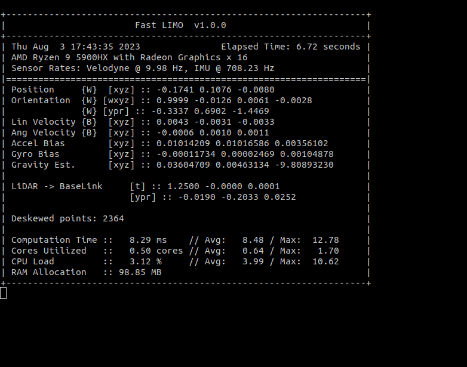

# Fast LIMO
<details>
    <summary>Table of Contents</summary>
    <ol>
        <li>
        <a href="#disclaimer">Disclaimer</a>
        </li>
        <li><a href="#dependencies">Dependencies</a>
        </li>
        <li><a href="#future-work">Future Work</a>
        </li>
        <li>
        <a href="#quick-start">Quick Start</a>
        </li>
        <li>
        <a href="#docker">Docker</a>
        </li>
        <li>
        <a href="#approach">Approach</a>
        </li>
        <li>
        <a href="#configuration">Configuration</a>
        </li>
        <li>
        <a href="#references">References</a>
        </li>
    </ol>
</details>

A real-time, tightly coupled LiDAR-Inertial SLAM algorithm developed on top of [IKFoM](https://github.com/hku-mars/IKFoM) _C++_ library. This project's implementation is based on the existing algorithms [FASTLIO2](https://github.com/hku-mars/FAST_LIO), [LIMO-Velo](https://github.com/Huguet57/LIMO-Velo) and [DLIO](https://github.com/vectr-ucla/direct_lidar_inertial_odometry).

`Fast-LIMO` has been developed as a __thread-safe__ _C++_ library with [Eigen3](https://eigen.tuxfamily.org/index.php?title=Main_Page) and [PCL](https://pointclouds.org/) as its only dependencies. This way, it can be used outside the ROS framework __without any changes__, making it more portable. This project acts as a ROS wrapper of the self-developed [fast_limo](include/fast_limo/)'s library.

`Fast-LIMO` stands for a multithreaded version of the approach _Localize Intensively Map Offline (LIMO)_ stated in [LIMO-Velo](https://github.com/Huguet57/LIMO-Velo) 's algorithm developed by [Huget57](https://github.com/Huguet57). 

<div align="center">
  
  <small>
  <p> Formula Student race car <a href="https://youtu.be/mk9U0lRWr-0?si=j4mM6e5dzihfCLJM">CAT15X</a>. Velocity in straights (~12m/s) and really tight turns (~100deg/s). </p>
  </small>
</div>
<br/>

<div align="center">
  
  <small>
  <p> <a href="https://www.cvlibs.net/datasets/kitti/index.php">KITTI</a> dataset (0071). Dynamic objects being added to the map. Still robust enough. </p>
  </small>
</div>
<br/>

<div align="center">
  
  <small>
  <p> Formula Student race car <a href="https://youtu.be/ly_ax8w-T7E?si=sDFiMFtRN5jRwWKC">XALOC</a>. High velocity in straights (~15m/s) and tight turns (~80deg/s). </p>
  </small>
</div>
<br/>

<div align="center">
  
  <small>
  <p> <a href="https://www.cvlibs.net/datasets/kitti/index.php">KITTI</a> dataset (0034). High velocity (~20m/s), smooth turns (~35deg/s). </p>
  </small>
</div>
<br/>

<div align="center">
  
  <small>
  <p> <a href="https://youtu.be/mElLMG7OPwo?feature=shared">ONA</a> robot. Double-ackermann autonomous delivery device.</p>
  </small>
</div>

## Disclaimer
If you plan to use `Fast-LIMO` please make sure to give some love to [LIMO-Velo](https://github.com/Huguet57/LIMO-Velo), [FASTLIO2](https://github.com/hku-mars/FAST_LIO) and [DLIO](https://github.com/vectr-ucla/direct_lidar_inertial_odometry) projects, which greatly influenced this work.

## Dependencies
<details open>
    <summary>Fast-LIMO C++14 library:</summary>
    <ol>
        <li>
        <a href="https://eigen.tuxfamily.org/index.php?title=Main_Page">Eigen3</a>
        </li>
        <li>
        <a href="https://pointclouds.org/">PCL (1.8)</a>
        </li>
    </ol>
</details>

<details>
    <summary>ROS2 (Humble) wrapper:</summary>
    <ol>
        <li>
        <a href="./include/fast_limo/">fast_limo</a>
        </li>
        <li><a href="http://wiki.ros.org/pcl_conversions">pcl_conversions</a>
        </li>
        <li>
        <a href="http://wiki.ros.org/sensor_msgs">sensor_msgs</a>
        </li>
        <li>
        <a href="http://wiki.ros.org/geometry_msgs">geometry_msgs</a>
        </li>
        <li>
        <a href="https://wiki.ros.org/tf2">tf2</a>
        </li>
        <li>
        <a href="https://wiki.ros.org/tf2_ros">tf2_ros</a>
        </li>
        <li>
        <a href="https://wiki.ros.org/visualization_msgs">visualization_msgs</a>
        </li>
        <li>
        <a href="https://wiki.ros.org/nav_msgs">nav_msgs</a>
        </li>
    </ol>
</details>

<details>
    <summary>ROS (Noetic) wrapper:</summary>
    <ol>
        <li>
        <a href="./include/fast_limo/">fast_limo</a>
        </li>
        <li>
        <a href="http://wiki.ros.org/pcl_ros">pcl_ros</a>
        </li>
        <li>
        <a href="http://wiki.ros.org/sensor_msgs">sensor_msgs</a>
        </li>
        <li>
        <a href="http://wiki.ros.org/geometry_msgs">geometry_msgs</a>
        </li>
        <li>
        <a href="https://wiki.ros.org/tf2">tf2</a>
        </li>
        <li>
        <a href="https://wiki.ros.org/visualization_msgs">visualization_msgs</a>
        </li>
        <li>
        <a href="https://wiki.ros.org/nav_msgs">nav_msgs</a>
        </li>
    </ol>
</details>

## Future Work (To Do)
### DevOps
- [X] ROS2 branch. 
### New Features
- [X] Take into account GPS data. _Pose-graph optimization using [GTSAM](https://github.com/borglab/gtsam)_
- [X] Add loop closure strategy. _Loop Closure detection with [ScanContext](https://ieeexplore.ieee.org/document/8593953)._
- [ ] Relocalize in previously saved pcl map. _Probably ICP-based correction for initial pose._

:envelope_with_arrow: _Feel free to reach out for new ideas or questions!_ :envelope_with_arrow:

## Quick Start
### 0. Cloning the repo
```sh
git clone https://github.com/fetty31/fast_LIMO
```

_More than half of the storage space needed to clone this repo is due to the [README gifs](doc/). There's a branch updated with the `master` but without all this media files called `no_media`._

### 1. Building fast LIMO
Use `colcon build --symlink-install` to build the code. By default it will compile under the `CMAKE_BUILD_TYPE="Release"` flag.

### 2. Running fast LIMO
```sh
ros2 launch fast_limo fast_limo.launch.py
```

Afterwards, you should be seeing this output _(if `verbose` param is set to true)_:

<div align="center">
<a>  </a>
</div>
<br />

You can also run `Fast-LIMO` together with an rviz instance with:
```sh
ros2 launch fast_limo fast_limo.launch.py rviz:=True
```

### 4. Quickly check its performance
[IN THIS FOLDER](https://www.dropbox.com/scl/fi/60u6xq0daav9enecluroh/cat15_trackdrive.bag?rlkey=jfjba58h8hohfi8b7kpi8zsvx&st=jck682n6&dl=0) you can find the rosbag file (___850.41 MB___) of [this CAT15X trackdrive](https://youtu.be/mk9U0lRWr-0?si=j4mM6e5dzihfCLJM). Download it and try it out!
```sh
ros2 launch fast_limo cat.launch.py rviz:=True
```

_Note that this algorithm's precision greatly depends on the pointcloud & IMU timestamps, so remember to run the rosbag with __use_sim_time=true__ and __--clock__ flag._

## Docker
A [Dockerfile](docker/Dockerfile) is provided in order to build a `Fast-LIMO` image on top of `ros2-humble` or `ros-noetic` desktop image.

Note that some bash scripts are given in order to quickly build & run the ROS docker container (__also enabling GUI applications__).
```sh
cd docker/
chmod +x build run
./build # build fastlimo docker image
./run   # deploy a fastlimo container
```

Finally, once inside the docker container run:
```sh
# ROS2 Humble
cd /home/colcon_ws/
colcon build --symlink-install
```

```sh
# ROS Noetic
cd /home/catkin_ws/
catkin_make
```

## Approach
If you are interested in truly understanding the working principle of this SLAM algorithm, please read the [FASTLIO paper](https://doi.org/10.48550/arXiv.2010.08196). _This project is merely an alternative implementation of this outstanding work, still relying upon [IKFoM](include/IKFoM/)._

This project implements the same concept as [LIMO-Velo](https://github.com/Huguet57/LIMO-Velo) but without any accumulation procedure. Instead, `Fast-LIMO` operates with two concurrent threads. One thread handles the propagation of newly received IMU measurements through the iKFoM (prediction stage), while the other thread uses these propagated states to deskew the received point cloud, match the deskewed scan to the map, and update the iKFoM (measurement stage) by minimizing point-to-plane distances.

`Fast-LIMO` supports the standard IMU-LiDAR configuration, where the IMU provides new measurements at a rate of 100-500 Hz and the LiDAR sends a new point cloud approximately at 10 Hz. __However, Fast-LIMO has been developed with the purpose to be used with a modified LiDAR driver capable of sending each scan packet as soon as it is ready, instead of waiting for the LiDAR to complete a full rotation.__

## Configuration
Here, the configuration file for `Fast-LIMO` is explained. _Note that some parameters relate to the __sensor type__ and __extrinsics__. The remaining parameters generally do not require modification for standard use, as they are associated with computational load limits or precision thresholds._

| Parameter             | Units | Summary                           |
| --------------        | ----- | --------------------------------- |
| num_threads           | -  | OpenMP threads (will be equal to $(nproc) if it is set higher). |
| sensor_type           | -  | LiDAR type (0: OUSTER \ 1: VELODYNE \ 2: HESAI \ 3: LIVOX). |
| debug                 | -  | Save useful intermediate pcl for visualization purposes (pc2match, deskewed...).  |
| verbose               | -  | Print debugging board with performance stats. |
| estimate_extrinsics   | -  | Enable continuous estimation of LiDAR-IMU extrinsics as in FASTLIOv2. |
| time_offset           | -  | Whether to take into account a possible sync offset between IMU and LiDAR (set to true if they are not properly synchronized).  |
| end_of_sweep          | -  | Whether the sweep reference time is w.r.t. the start or the end of the scan (only applies to VELODYNE/OUSTER sensors, which have relative timestamp). |
| calibration/gravity_align | - | Estimate gravity vector while the robot is at stand still. |
| calibration/accel         | - | Estimate linear accel. bias while the robot is at stand still. |
| calibration/gyro          | - | Estimate angular velocity while the robot is at stand still. |
| calibration/time          | s | Time at the beggining to estimate the quantities above. The robot MUST be at stand still. If all three flags above are set to false, no estimate will be done.  |
| extrinsics/imu            | SI | IMU pose with respect to base_link coordinate frame. |
| extrinsics/lidar          | SI | LiDAR pose with respect to base_link coord. frame.  |
| intrinsics                | SI | IMU lin. acc. + gyro. biases.  |
| filters/cropBox           | m | Prismatic crop. Useful for removing LiDAR points that fall into the robot itself. Should be a 3D rectangle envolving the robot. |
| filters/voxelGrid         | m | Voxel Grid filter. Pointcloud downsampling strategy. |
| filters/minDistance       | m | Could be interpreted as a sphere crop. Removes all points closer than its value. _Useful for avoiding having too many ground points._ |
| filters/FoV               | deg | Field of View (FoV) crop filter. Removes all points that are not inside the given angle. _Useful for reducing the number of points to account for._ |
| filters/rateSampling      | - | Quick downsampling method. Only takes into account 1 in every _value_ points. _Useful for reducing the computational load._ |
| iKFoM/MAX_NUM_ITERS       | - | The Extended Kalman Filter will do _MAX_NUM_ITERS_+1 iterations. _Useful for reducing the computational load._ |
| iKFoM/MAX_NUM_MATCHES     | - | Max. number of matches to account for when computing the Jacobians. _Useful for reducing the computational load._|
| iKFoM/MAX_NUM_PC2MATCH    | - | Max. number of points to consider when matching the current scan with the map. _Useful for reducing the computational load._ |
| iKFoM/Mapping/NUM_MATCH_POINTS  | - | Number of points that constitute a match. |
| iKFoM/Mapping/MAX_DIST_PLANE    | m | Max. distance between all points of a match. |
| iKFoM/Mapping/PLANES_THRESHOLD  | m | Threshold to consider if a match point is part of a plane. |
| iKFoM/Mapping/Octree/bucket_size      | - | Maximum number of points allowed in an octant before it gets subdivided. |
| iKFoM/Mapping/Octree/min_extent           | m | Minimum extent of the octant (used to stop subdividing). |
| iKFoM/Mapping/Octree/downsampling            | - | Whether to downsample the octree. |
| iKFoM/covariance                | m^2 | Covariance of IMU measurements. |

## References
This project relies upon [HKU-Mars](https://github.com/hku-mars)' open-source _C++_ library:
- Iterative Kalman Filters on Manifolds ([IKFoM](include/IKFoM/)) 